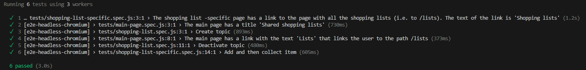

# Project 1: Shared shopping list

A web application that is used as a shared shopping list. User can manage shared shoppling lists as well as items in those lists.

## Online location
You can access the web application by the [link](https://shopping-lists-eh3e.onrender.com/)

## Run the application locally

User [docker-compose](https://docs.docker.com/compose/install/) to run the whole application (database included).

```bash
docker compose up
```

Then the application launches on the port 7777 by default

You can access application by localhost:7777

## Testing

There are 6 end-to-end tests written in [e2e-playwright](e2e-playwright) folder including tests for:
1. Main page requirement
2. Creating, listing and deactivating shopping list requirements
3. Creating, listing and collecting items in list

End-to-end tests can be run using [docker-compose](https://docs.docker.com/compose/install/).
1. Remove current containers to clear data in local database first:
```bash
docker compose rm -sf
```
2. Run the tests:
```bassh
docker compose run --entrypoint=npx e2e-playwright playwright test && docker compose rm -sf
```

The result after running test would be like this:



If some tests fail, it might be because the data in database has not been cleared before running the tests, which is done by 
```bash
docker compose rm -sf
```
<!-- Write the documentation of your project here. Do not include your personal
details (e.g. name or student number).

Remember to include the address of the online location where your project is
running as it is a key part of the submission. -->
